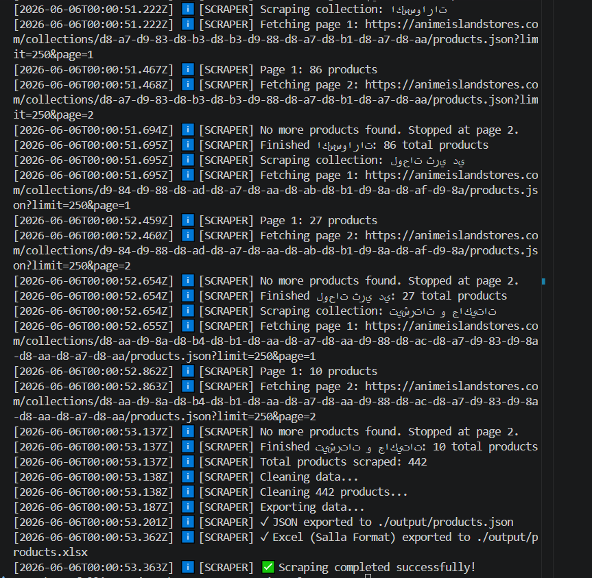
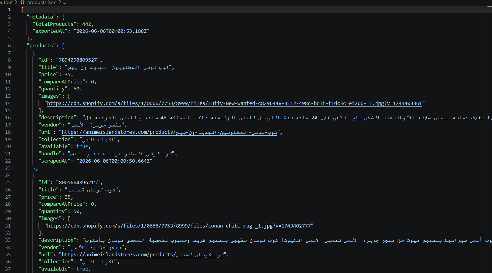
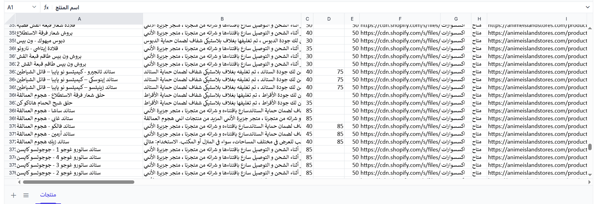

Markdown
# 🕷️ Advanced Shopify Collection Scraper & Data Pipeline

A production-ready Node.js automation tool designed to systematically extract, paginate, clean, and format product data from any Shopify-based store. This script bypasses default API limits to create seamlessly structured datasets tailored for e-commerce migration (specifically optimized for Middle Eastern platforms like **Salla** and **Zid**).

---

## 📸 Project Showcase & Output Visuals

Here is a preview of the system architecture, execution logs, and the highly organized end-product:

### 1. High-Performance Scraping Engine (Terminal Execution)
*Real-time monitoring of collection indexing, continuous pagination management, and safe data compilation.*


### 2. Multi-Channel Data Synchronization (JSON Output)
*Comprehensive raw hierarchical product nodes including deep variants metadata and calculated inventory rules.*


### 3. Client-Ready Excel Deliverable (Salla & Zid Formats)
*The final cleanly mapped spreadsheet featuring auto-formatted Master product image matrices, translated taxonomies, and calculated standard inventory volumes.*


---

## ⚙️ How It Works (The Data Pipeline)

The system works through a structured 4-step architecture to ensure data integrity and prevent anti-bot triggering:

[Target Store] ➔ [1. Dynamic Pagination Engine] ➔ [2. Data Cleaning Pipeline] ➔ [3. Format Mapping] ➔ [4. Final Excel/JSON]


1. **Dynamic Pagination Engine (`shopify.js`):** Shopify imposes a strict server-side limit of **250 products per request**. This tool implements an automated asynchronous `while` loop that sequentially requests `page=1`, `page=2`, etc., dynamically merging the datasets until all hidden products are collected. It also includes an auto-throttled delay to safeguard your IP from rate limits.
   
2. **Data Cleansing Engine (`cleaner.js`):** Raw Shopify text contains nested symbols, broken protocols, and raw HTML descriptions. The cleaner strips unwanted scripts, normalizes product protocols (e.g., standardizing `//cdn.shopify...` to absolute `https://`), and handles unavailable items.

3. **Smart Inventory Logic:** To protect your store from immediate out-of-stock statuses post-import, the script evaluates inventory flags. If a product is marked available, it automatically injects a safe base inventory quantity (e.g., `50`), otherwise setting it to `0`.

4. **Structured Mapping & Export (`exporter.js`):** Maps multi-image arrays into comma-separated strings compatible with **Salla/Zid bulk-import**, structures standard pricing alongside promotion/discount prices, and exports them directly into production-ready Excel (`.xlsx`) spreadsheets.

---

## ✨ Key Features

- **Infinite Page Traversal:** Overcomes Shopify’s 250-item hard barrier using smart pagination.
- **Master Image Extraction:** Extracts high-resolution master images and joins gallery rows with standard separators.
- **Dynamic Localization:** Standardizes and transforms complex Shopify categories into clean, readable Arabic/English store taxonomies.
- **Price-Drop Calculations:** Captures current prices alongside "Compare At" markdown values to sustain promotional campaigns during migration.
- **Anti-Throttle Shield:** Built-in execution intervals to keep web requests beneath anti-scraping alert thresholds.

---

## 📂 Project Structure

```text
shopify-scraper/
├── src/
│   ├── main.js                 # Unified entry point triggering the pipeline
│   ├── config/
│   │   └── collections.js      # Target store endpoints and category mapping definitions
│   ├── scrapers/
│   │   └── shopify.js          # Core network request and pagination state logic
│   ├── services/
│   │   ├── exporter.js         # Buffer engine transforming records into JSON & Excel sheets
│   │   └── cleaner.js          # Regex and formatting sanitization scripts
│   └── utils/
│       └── logger.js           # Automated runtime and diagnostic logger
├── output/                     # Production target folder (Ignored in public Git)
│   ├── products.json           # Raw structural database
│   └── products.xlsx           # Final client import sheet
├── package.json
└── README.md


🚀 Installation & Quickstart
Prerequisites
Make sure you have Node.js installed on your machine.

1. Clone & Install Dependencies
Bash
git clone <your-repository-url>
cd shopify-scraper
npm install
2. Configure Collections
Open src/config/collections.js and input your target store collection handles:

JavaScript
module.exports = [
  { name: 'Anime Mugs', url: '[https://store-url.com/collections/mugs](https://store-url.com/collections/mugs)' },
  // Add more targets here
];
3. Fire Up the Scraper
Run standard execution mode:

Bash
npm start
Or initiate active development watching mode:

Bash
npm run dev
🛠️ Tech Stack & Architecture
Runtime: Node.js (V8 Engine)

HTTP Client: Axios (Configured with specialized User-Agents to prevent handshaking drops)

Data Mutation: SheetJS / XLSX (Direct memory buffer generation for fast file writes)

Process Manager: Nodemon (Development watch state)

📄 License
This project is licensed under the MIT License.